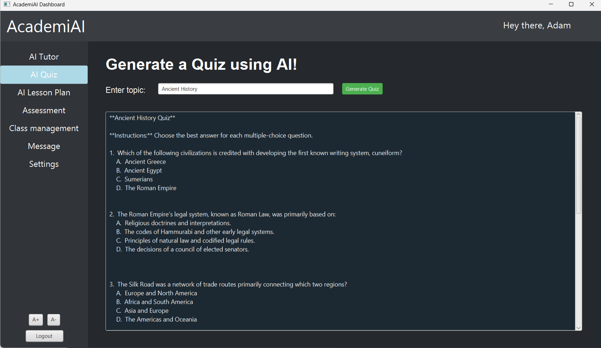
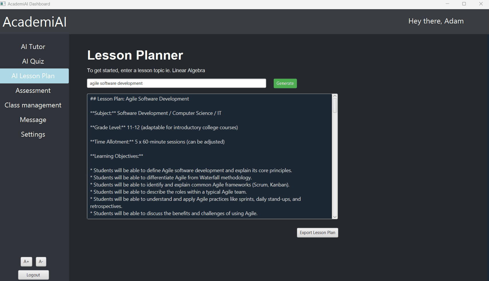

# AcademiAI: AI-Powered Teacher's Assistant

This project is a JavaFX desktop application developed for the QUT unit CAB302 - Software Development. It was a team-based assessment simulating a full software development lifecycle using Agile methodologies.

The application, "AcademiAI," is an AI-powered classroom tool designed to enhance learning outcomes and reduce teacher workload. It provides core functionality for user management, class administration, and AI-driven content creation.

## 1. Project Overview & Key Features

This application is a functional prototype that demonstrates key software engineering principles, including object-oriented design, database persistence, and integration with external services.

  - **User Authentication:** Secure user sign-up and login system. Passwords are not stored in plaintext; they are hashed using **jBCrypt**.

  - **Database Persistence:** All user and class data is stored in a local **SQLite database**, managed via JDBC.

  - **CRUD Functionality:** The system supports full Create, Read, Update, and Delete (CRUD) operations for user accounts, allowing users to register, log in, and update their profiles.

  - **AI Quiz Generation:** Integrates with a local LLM (via Ollama) to generate quizzes on demand. A teacher can input a topic, and the AI will return a set of questions and answers.

  - **Class Management:** A dashboard interface for teachers to manage their classes, track student attendance, and assign grades (prototype).


## 2. Tech Stack & Architecture

This project was built with a focus on robust, maintainable, and testable code, adhering to industry best practices as required by the assessment.
```
Category	Technology
Language:	Java 17+
Framework (UI):	JavaFX
Database:	SQLite (via JDBC)
AI Integration:	Ollama (Local LLM)
Password Hashing:	jBCrypt
DevOps & VC:	Git, GitHub, GitHub Actions (for CI/CD)
Methodology:	Agile, Test-Driven Development (TDD)
```

### Architectural Design

The application's architecture emphasizes the separation of concerns, making it modular and testable.

  - **Model-View-Controller (MVC):** JavaFX (``.fxml``) files define the View, ``controllers`` (like ``DashboardController.java`` and ``LogInController.java``) handle user input, and POJOs (like ``User.java``) act as the Model.

  - **Data Access Object (DAO) Pattern:** The application decouples business logic from data persistence. The ``UserDAO.java`` interface defines the contract, and ``SqliteUserDAO.java`` provides the concrete SQLite implementation.

  - **Singleton Pattern:** The ``DatabaseConnection.java`` class uses a Singleton pattern to ensure only one database connection instance is shared across the entire application, preventing resource exhaustion.
	 
## 3. My Contributions

As this was a team project, my role involved both technical implementation and project management. My contributions were focused on architecting and building the entire database and security backend, implementing all AI-powered features, and driving the project's Test-Driven Development (TDD) and documentation standards.

  ### **Database Architecture (Owner):** 
	 
- Architected and built the entire database layer from the ground up, including the ``DatabaseConnection`` singleton, ``DatabaseSchemaManager``, and the full ``UserDAO`` interface and ``SqliteUserDAO`` implementation.

- Implemented the critical **jBCrypt password hashing** feature to ensure no plaintext passwords are ever stored.
	
- Expanded the database schema and DAO layer to support new features like Teacher/Student user types, grades, and classes.

 ### **AI (LLM) Feature Implementation:** 
	
- Implemented the **"AI Quiz Creator"** feature, integrating with a local Gemma 3 model (via Ollama) to generate quizzes.

- Developed the **"AI Tutor"** chat feature, providing users with real-time, AI-powered assistance.

- Improved UX by adding visual feedback to the user while the LLM is processing a request.

 ### **Test-Driven Development (TDD) & Refactoring:** 

- Drove the project's testing strategy by writing a comprehensive suite of **14+ unit tests** for the entire database layer (``DatabaseConnection``, ``DatabaseSchemaManager``, ``SqliteUserDAO``).

- Authored unit tests for the AI (Ollama) response models.

- Refactored the database layer to adhere to the **Single Responsibility Principle (SRP)**, enhancing modularity and testability.

 ### **CI/CD & Documentation:**
	
- Contributed to the CI/CD pipeline by adding the **Maven Javadoc Plugin** to the ``pom.xml`` and fixing ``.yml`` permissions to enable unit tests in the build.

- Wrote extensive Javadoc comments for the database and model classes, and included Javadocs in version control.

 ### **Agile Project Management:**

 - Took a lead role in the Agile process, organizing weekly stand-up meetings, sprint planning sessions, and retrospectives.

 - Maintained all project artifacts, including meeting notes, user stories, and the product backlog, to ensure the team stayed on track with assessment milestones.

## 4. How to Run

1. **Clone the repository:**
```
https://github.com/A-Cummins528/Teachers-Assistant-AI-Powered-Classroom-Tool.git
```

2. **Prerequisites:**
- Ensure you have **Java (JDK 17 or newer)** (e.g., [Amazon Corretto](https://aws.amazon.com/corretto/)) and **JavaFX SDK** installed.

- For the AI feature, you must have [Ollama](https://ollama.com/) installed and running locally with a model (e.g., ``ollama run llama3``).

- **No database server is required.** The application uses an embedded SQLite database. It will automatically create the ``database.db`` file in the project's root directory when you first run the program.

3. **Run the Application:**

- Open the project as a Maven project in your preferred Java IDE (e.g., IntelliJ IDEA).

- Configure your IDE's run configuration to include the JavaFX VM options.

- Run the main application class.

## 5. Project Origin & Future Direction

This project was originally a collaborative effort for a university assessment by **Team Alfred**. I would like to acknowledge the contributions and teamwork from the original members:

 - Joshua Madams

 - Philip Mouton

 - Felix Nguyen

 - Justin Coglan

This repository is based on that initial team submission. I am now maintaining and expanding this project solo. Future work will involve refactoring the existing codebase, fixing bugs, and implementing new features to further develop the "AcademiAI" concept.
